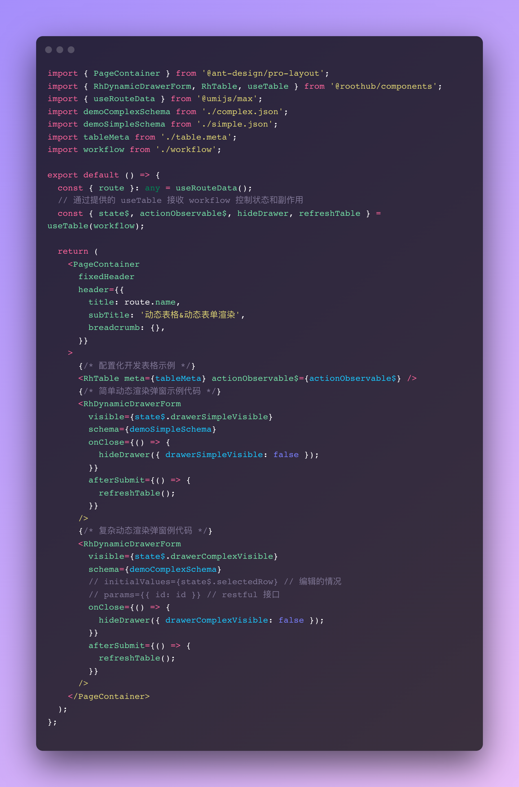
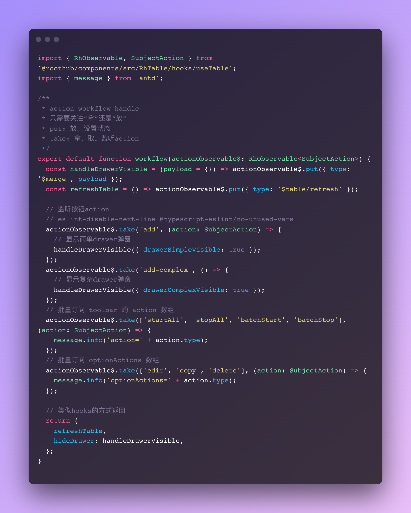
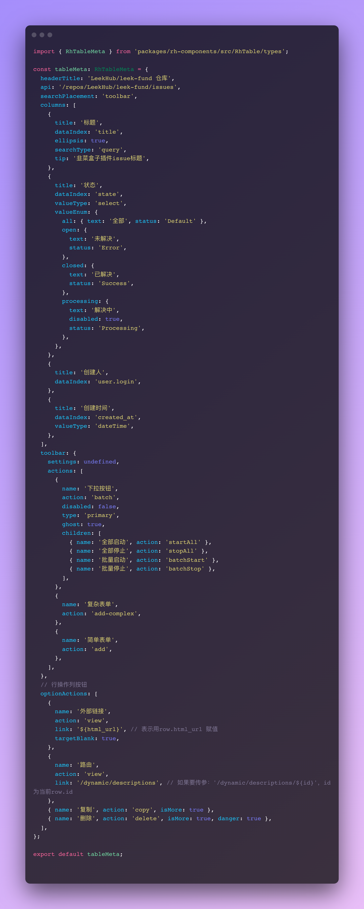

# rh-template-umi

基于 Umi 的中后台前端工程脚手架，在线预览：https://rh-umi.vercel.app

遵守「摸鱼最佳解决方案」的三个原则：

- 1、**更少的代码**。 不写可能重复写的任何代码逻辑。
- 2、**可扩展性，无技术债**。组件封装都无 breaking changed，保留原生写法的前提下扩展动态配置开发方式。
- 3、**保证易维护性、复用性**。换团队时组件、配置化开发方式都能复用。

## 技术栈

- Umi 4.x
- React18 + TypeScript + RxJS
- @ant-design/charts

## 功能特点

- 自定义 Sidebar 菜单
- 内置常用组件
- Antd 样式覆写 `styles/reset/*`
- 配置化开发，json 动态渲染，少量代码完成重复一样的页面开发
- 没有 Redux 等，用 RxJS 解决状态机问题，但你可以不写 RxJS
- 更少的心智和学习成本，如果你熟悉 Antd ProComponent 组件，你就是摸鱼大师

yarn workspaces （[文章介绍](https://juejin.cn/post/7011024137707585544))

```json
{
  "@roothub/code-editor": {
    "location": "packages/code-editor",
    "workspaceDependencies": [],
    "mismatchedWorkspaceDependencies": []
  },
  "@roothub/components": {
    "location": "packages/rh-components",
    "workspaceDependencies": ["@roothub/helper"],
    "mismatchedWorkspaceDependencies": []
  },
  "@roothub/helper": {
    "location": "packages/rh-helper",
    "workspaceDependencies": [],
    "mismatchedWorkspaceDependencies": []
  }
}
```

## TODO

> RxJS 相关的使用封装，要做到心智成本低，易上手易维护，使用者使用时可以不懂 RxJS。

- [x] yarn workspaces 组件库和共享库
- [x] 配置化表格开发封装
- [x] 表格数据共享通信方案 `state$` 和 `actionObservable$`
- [x] 动态表单
  - [x] drawer form
  - [x] 单页 form
  - [x] form-item 代码优化
  - [x] modal form
- [x] workflow 灵活写法扩展
- [ ] RxJS 封装全局数据状态管理
- [ ] 组件完善(WIP)
  - [ ] RhSelect 组件接口返回结构
  - [ ] RhCascaderSelect 组件接口返回结构
- [ ] 开发方案文档&demo
- [ ] Json 配置化块级代码生成工具开发

## 使用说明

Install dependencies,

```bash
$ yarn
```

Start the dev server,

```bash
$ yarn dev
```

## Screenshots

### 配置化开发代码示例

- 在线 demo 页面：https://rh-umi.vercel.app/table/meta
- 源码文件：https://github.com/giscafer/rh-template-umi/blob/main/src/pages/table/meta/index.tsx

页面代码，逻辑和 UI 分离



workflow.ts 处理页面逻辑/副作用



table-meta.ts 列表配置代码



## License

MIT author[@giscafer](https://giscafer.com)
